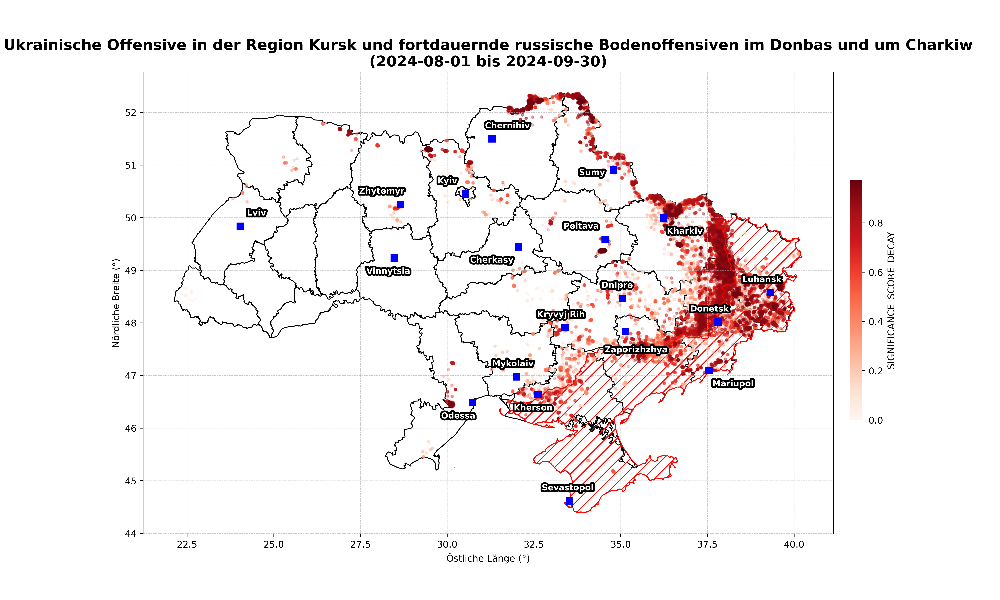

# Forest Fire Classification in Ukraine

This repository provides an implementation for classifying forest fires in Ukraine between February 2022 and September 2024 as potentially war-related or natural fires. This work extends *The Economist's* Ukraine war-fire model, which uses machine learning techniques and publicly available satellite data from NASA's FIRMS (Fire Information for Resource Management System) to detect potential war events.

## Project Overview

The primary objective of this project is to enhance the classification of forest fires in Ukraine during the ongoing conflict. Leveraging machine learning techniques, this project aims to distinguish between natural and war-related fire events. The original work by *The Economist* detected thousands of such events, and this repository builds on those foundations by incorporating additional data, improved models, and new approaches for explainability and visualization.

Key features of the project include:
- Training on historical natural fire data to build a model for classifying recent fire events.
- Utilizing explainable AI (XAI) methods to provide transparency in model predictions.
- Generating visualizations for insights into fire patterns and relationships with population density and land use.
- Adding an interactive dashboard for visualization of fire events, model predictions, and contextual information.

## Repository Structure

The repository is organized as follows:

- **config/**: Configuration files for the project.
  - **config.py**: Configuration settings for the pipeline.
  - **ukr_weather_api_call_data.csv**: Coordinates for weather API calls.
- **data/**: Contains various datasets related to the project.
  - **rus_control/**: Data related to Russian occupied territory.
  - **ukr_borders/**: Data related to Ukraine's borders.
  - **ukr_fires/**: Fire event data.
  - **ukr_land_use/**: Land use data for Ukraine.
  - **ukr_oblasts/**: Data on Ukrainian oblasts.
  - **ukr_pop_density/**: Population density data.
  - **ukr_war_events/**: Data related to war events.
  - **ukr_weather/**: Weather data for Ukraine.
- **models/**: Directory to store trained models.
- **results/**: Stores model predictions and visualizations.
  - **50km/**: Contains CSV files with results at 50km resolution.
  - **plots/**: Subfolder with generated plots.
- **src/**: Source code for the project.
  - **plotting/**: Contains plotting utilities.
    - **plotting.py**: Plotting functions for visualization.
  - **preprocessing/**: Scripts for preprocessing data.
    - **feature_engineering.py**: Feature engineering scripts.
    - **load_data.py**: Data loading functions.
    - **update_data.py**: Functions to update data.
  - **models/**: Contains model-related scripts.
    - **error_threshold.py**: Handles error threshold calculations.
    - **explainer.py**: Functions for explainability.
    - **nearest_neighbor.py**: Nearest neighbor analysis.
    - **score_decay.py**: Handles score decay calculations.
  - **pipelines/**: Pipeline scripts for data and model processing.
    - **data_pipeline.py**: Data processing pipeline.
    - **model_pipeline.py**: Model training and inference pipeline.
  - **dashboard/**: Visualization dashboard for fire data.
    -**dasboard.py**: Dash leaflet dashboard code.
- **notebook.ipynb**: Jupyter notebook showcasing the end-to-end pipeline, including training, testing, and visualization.
- **LICENSE**: License information for the project.
- **poetry.lock**: Lockfile for managing project dependencies.
- **pyproject.toml**: Project configuration and dependencies.
- **README.md**: Documentation for the project, including usage instructions and context.

## Getting Started

### Prerequisites

- Python 3.12 or higher
- Jupyter Notebook
- Poetry for dependency management

To install the required libraries, run:
```sh
poetry install
```

### Running the Pipeline

1. **Data Loading and Preprocessing**: The data is loaded using the `DataPipeline` class, which preprocesses the data for model training and evaluation.

2. **Model Training**: The `FirePredictionPipeline` class is used to train the model on historical fire data.

3. **Inference and Evaluation**: After training, the model is saved and can be reloaded for inference on recent fire events. Predictions are saved for further analysis.

4. **Nearest Neighbor Analysis and Explainability**: The pipeline also includes functions for finding nearest neighbors and explaining individual predictions.

5. **Visualization**: The notebook includes plotting utilities to visualize the results, including fire locations, population density, and land use maps.

### Example Usage

Refer to the Jupyter notebook (`notebook.ipynb`) for an example of the complete pipeline, including data loading, model training, prediction, and visualization.

## Visualization

The project includes a range of visualizations to help understand the model's performance and the relationship between fires, population density, and land use.

- **Fire Data Plots**: Visualize normal and abnormal fires over specific events and timeframes.
- **Population Density and Land Use Maps**: Visualize population density and land use across Ukraine to understand how these factors correlate with fire events.

### Example Plots

Here are some example plots generated by the pipeline, located in the `results/50km/plots` folder:

#### Events Since February 24th, 2022


#### Events Since February 24th, 2022 with Significance Score


#### Events From August 1st, 2024, to September 30th, 2024


#### Events From August 1st, 2024, to September 30th, 2024 with Significance Score



## Interactive Dashboard

The interactive dashboard provides a visual exploration of fire events and related contextual information in Ukraine. Using Dash Leaflet, the dashboard enables users to:

- **Select Dates**: View the number of fires on any selected date. Use the interactive plot to click on a specific date and update the map accordingly.
- **Visualize Fire Events**: Distinguish between potentially war-related and natural fires by toggling different layers on the map. War-related fires are shown in red, while normal fires appear in gray.
- **Explore Regions and Overlays**: Examine additional layers like Russian-occupied territories, cloud cover, temperature data, and Intelligence Reports. Use the control panel to toggle these layers on and off.
- **Cluster Visualization**: Adjust the number of clusters dynamically to view fire events as aggregated groups, helping to highlight spatial patterns and significant fire hotspots.
- **View Fire Details**: Click on individual fire markers or clusters to view detailed information about each fire, including date, location, and significance scores.

Below are some screenshots of the interactive dashboard:

#### War-Related Fire Events on March 23rd, 2022


#### War-Related Fire Events on September 1st, 2024 with Significance Score


#### War-Related Fire Events on September 28th, 2023 with Natural Fires


#### War-Related Fire Events on July 7th, 2022 with UK Department of Defence Intelligence Report


## Relation to *The Economist's* Ukraine War-Fire Model

This project builds upon *The Economist's* Ukraine war-fire model, which used machine learning techniques and satellite temperature anomaly data from NASA's FIRMS (Fire Information for Resource Management System) to detect war-related fire events. You can find the original repository and data here: [Tracking the Ukraine war: where is the latest fighting?](https://www.economist.com/interactive/graphic-detail/ukraine-fires) and in the corresponding [GitHub Repository](https://github.com/TheEconomist/the-economist-war-fire-model).

This repository extends that work by:
- Adding additional data sources like dynamic weather data to improve model predictions.
- Implementing techniques to compute the significance score for each prediction.
- Incorporating XAI techniques for better understanding of model predictions.
- Providing an interactive Dash Leaflet Dashboard.

## License

This project is licensed under the MIT License - see the [LICENSE](LICENSE) file for details.

## Contact

For any questions, please reach out at [gianluca.manca89@gmail.com].